# 智能算法刷题平台——后台管理系统

## 🖼️仓库介绍

该仓库是智能算法刷题平台的后台管理系统仓库，用于管理系统中的相关数据，例如：系统整体数据统计、用户数据、题目数据等等。并且可以配合`题目信息管理助手`来更加智能地管理系统中的题目数据。

## ✨技术栈总览

1. Vue3：前端开发框架。
2. Pinia：全局状态管理。
3. Axios：发送 HTTP 请求。
4. Ant-Design-Vue：CSS 组件库。
5. Ant-Design-X-Vue：AI 组件库。
6. Monaco-Editor：前端代码编辑器。
7. Markdown-it：前端 Markdown 语法渲染库。
8. Vue-Echarts：图标展示库。
9. Nprogress：顶部加载进度条。

## 💻相关界面展示

### 登录页面


### 系统首页

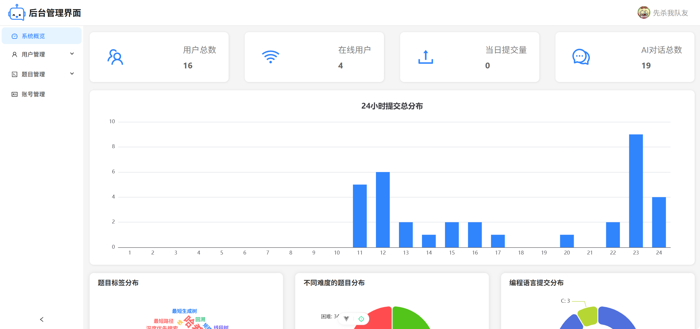

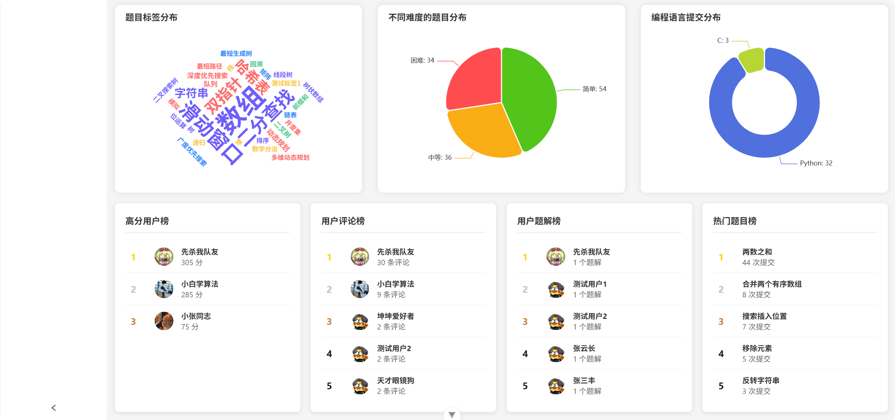

### 用户信息展示

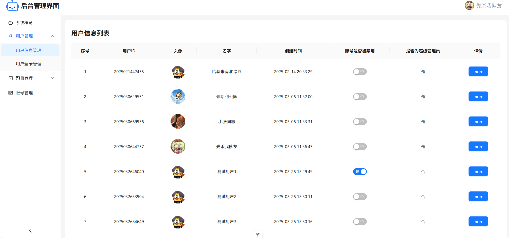

### 用户登录状态展示

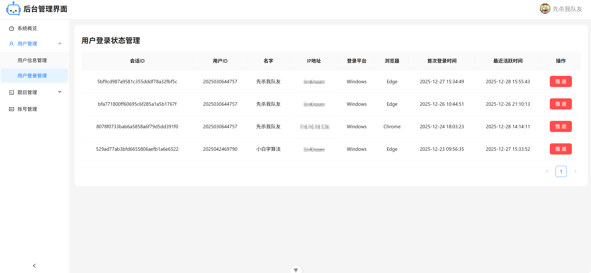

### 题目信息管理

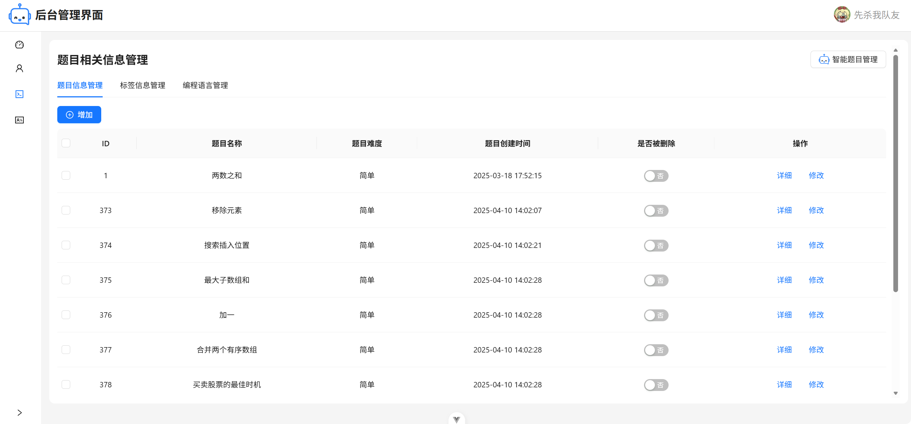

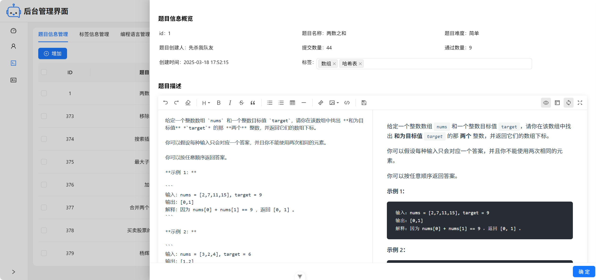

### 智能题目管理

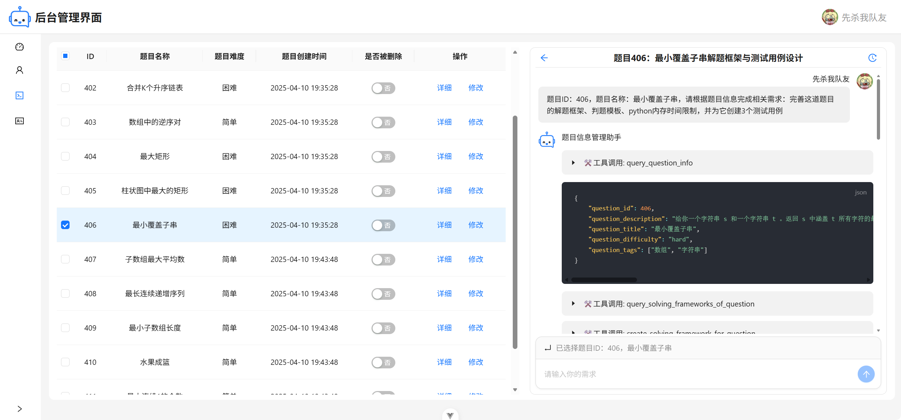

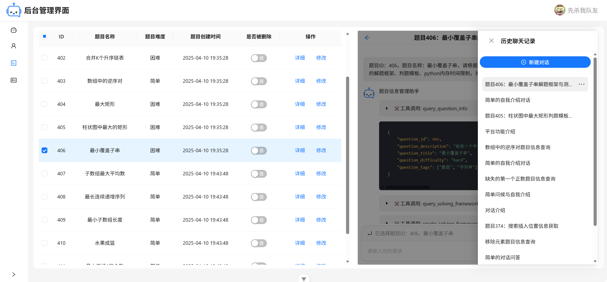

### 标签信息管理

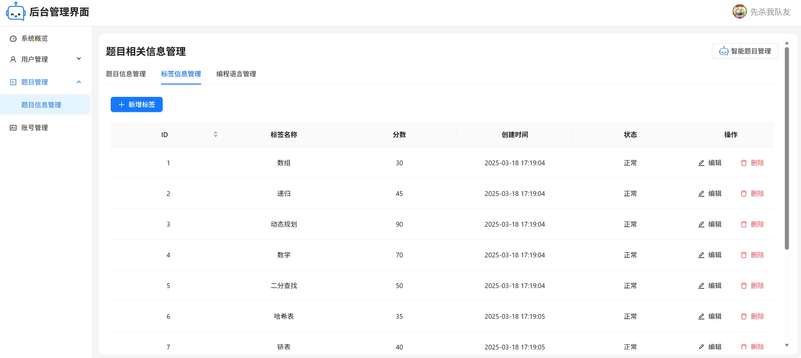

### 编程语言管理

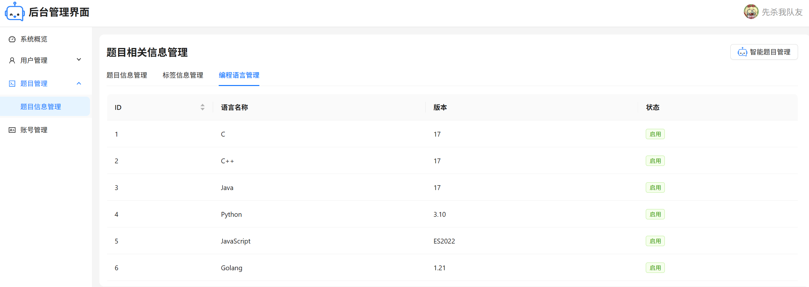

### 管理员基本信息管理

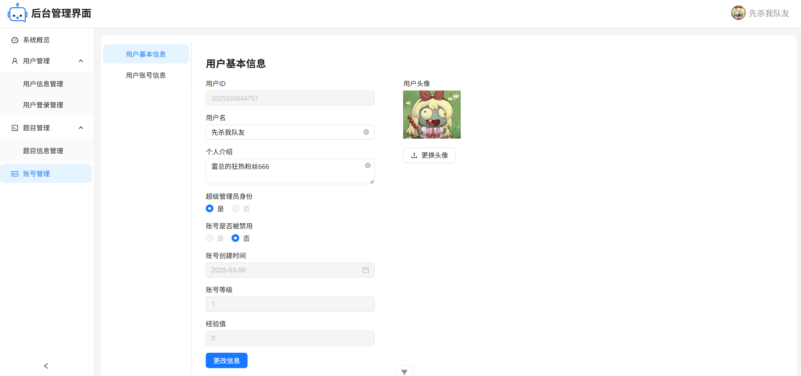

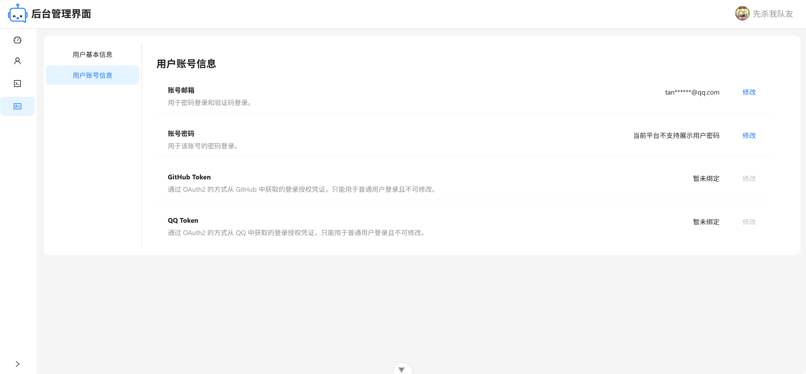

## ⚒️启动项目

项目依赖了后端服务和 AI 服务，因此需要先部署好这两个服务才能正常运行。

1. 后端服务：[后端仓库与相关部署指南](https://github.com/SmartOnlineJudge/smartoj-backend)。
2. AI 服务：[AI 服务代码仓库与相关部署指南](https://github.com/SmartOnlineJudge/smartoj-ai-service)。

首先确认 NodeJS 的版本，项目开发时使用的版本是：`v22.2.0`。

在确认好 NodeJS 的版本以后，编写项目目录下的`.env.production`文件：

```
# 后端接口地址
VITE_BACKEND_URL = http://127.0.0.1:8000

# AI服务后端接口地址
VITE_AI_SERVICE_BACKEND_URL = http://127.0.0.1:8001

# MinIO 地址
VITE_MINIO_URL = http://127.0.0.1:9000
```

将上述 3 个地址改成已经部署好的地址，其中 MinIO 地址在部署后端服务之前应该就已经部署好了。

然后使用常用的 NodeJS 包管理器（npm、pnpm、yarn等）来安装项目的第三方库：

```bash
npm install
```

最后在本地启动项目：

```bash
npm run dev

> smartoj-management@0.0.0 dev
> vite


  VITE v6.1.0  ready in 720 ms

  ➜  Local:   http://localhost:5173/
  ➜  Network: http://10.255.255.254:5173/
  ➜  Network: http://172.21.143.87:5173/
  ➜  Vue DevTools: Open http://localhost:5173/__devtools__/ as a separate window
  ➜  Vue DevTools: Press Alt(⌥)+Shift(⇧)+D in App to toggle the Vue DevTools
  ➜  press h + enter to show help
```
